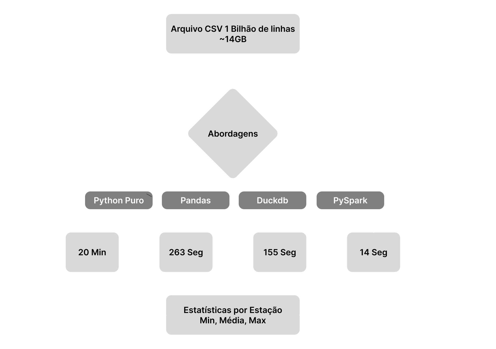
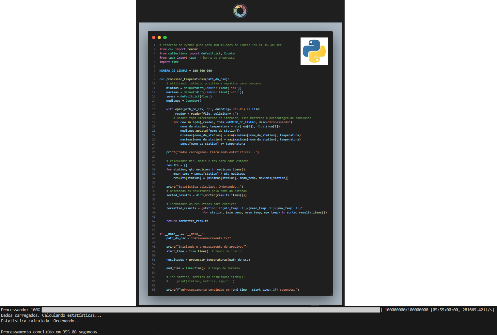
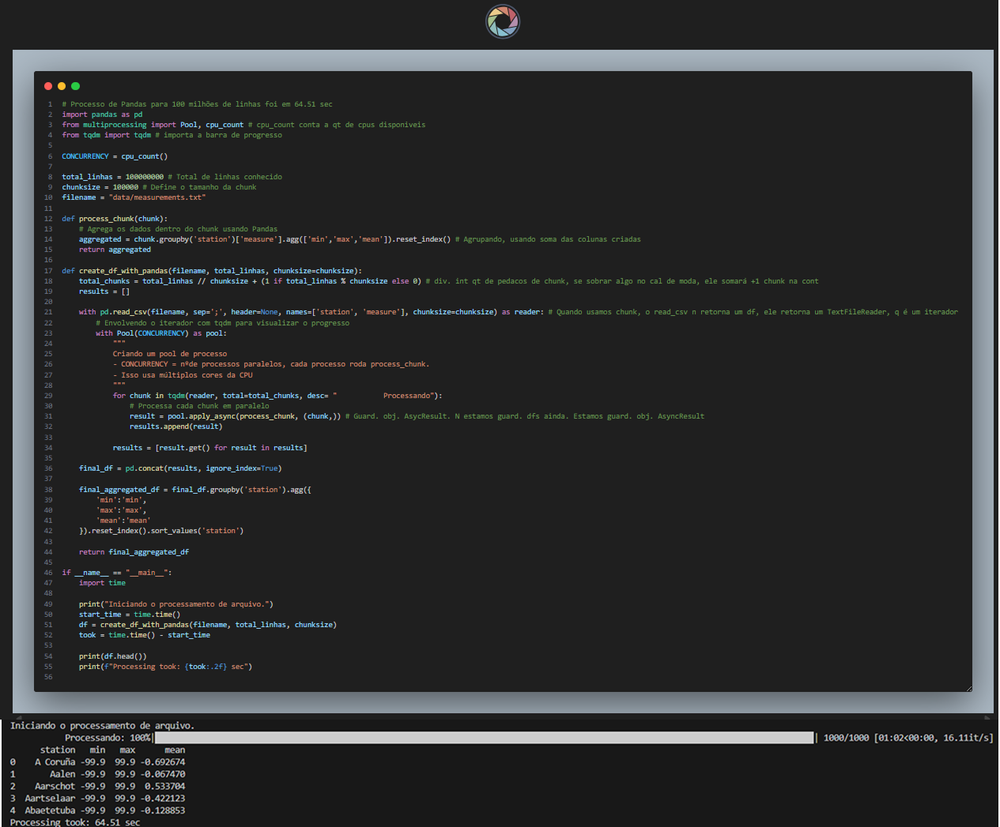
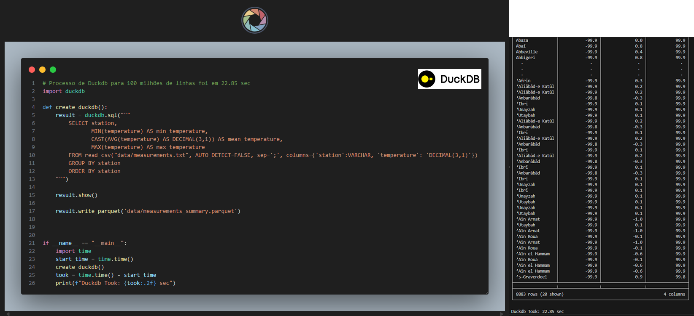

# Projeto: ETL Big Data Python
-----

## 📋 Sobre

Este projeto demonstra como processar eficientemente **1 bilhão de linhas de dados** (~14GB) usando diferentes abordagens em Python. O desafio é calcular estatísticas (mínimo, média e máximo) de temperaturas por estação meteorológica, comparando o desempenho de várias bibliotecas e técnicas.

[](https://suajornadadedados.com.br/)
[](https://python.org)
[](https://pandas.pydata.org/)
[](https://duckdb.org/)
[](https://docs.databricks.com/aws/en/)
-----

## 📊 Fluxo do Projeto



-----

## 📁 Estrutura do Projeto

```
02-python-big-data-processing/
├── src/
│   ├── create_measurements.py    # Gera arquivo de teste com 1 bilhão de linhas
│   ├── using_python.py            # Implementação em Python puro
│   ├── using_pandas.py           # Implementação com Pandas
│   ├── using_dask.py             # Implementação com Dask
│   ├── using_polars.py           # Implementação com Polars
│   ├── using_duckdb.py           # Implementação com DuckDB
│   └── using_bash_and_awk.sh      # Implementação em Bash + awk
├── data/
│   ├── measurements.txt          # Arquivo gerado com dados de teste
│   └── weather_stations.csv      # Lista de estações meteorológicas
├── pyproject.toml                # Dependências do projeto
└── README.md                     # Este arquivo
```

-----

## ⚙️ Técnicas e Conceitos Aplicados
### 🔄 ETL vs ELT

**🔹 ETL (Extract, Transform, Load)**

Fluxo tradicional:
1. Extract → Extração dos dados

2. Transform → Transformação antes de carregar

3. Load → Disponibilização para consumo

📌 Características:

* Transformação ocorre fora do banco.
* Menor custo de armazenamento.
* Bastante utilizado em pipelines tradicionais.
* Pode dificultar rastreabilidade quando há erro no dado transformado.

-----

**🔹 ELT (Extract, Load, Transform)**

Fluxo moderno:
1. Extract → Extração dos dados

2. Load → Carregamento no banco (dados brutos)

3. Transform → Transformação dentro do banco

📌 Características:

* Dados brutos ficam armazenados.
* Melhor governança e auditoria.
* Mais fácil identificar se o problema está no dataset ou na transformação.
* Maior custo de storage.

Ferramenta comum nesse modelo: dbt-core (transformações via SQL dentro do banco).

📌 Observação histórica:
Esse modelo se tornou viável com a redução do custo de armazenamento ao longo dos anos.

-----

## 📂 Load Less Data

Carregar apenas o necessário é uma das maiores otimizações possíveis.

* Evite colunas desnecessárias
* Evite linhas irrelevantes
* Reduza leitura de disco (I/O)
* Reduza uso de memória
* Menos dados = menos custo computacional

-----

## 🧠 Uso Eficiente de Tipos de Dados

Escolher o tipo correto impacta diretamente memória e performance.

🔹 category

Ideal para colunas com muitos valores repetidos (ex: cidade, estação).
Equivalente ao conceito de tabela dimensão no modelo dimensional.
Internamente, ele armazena um identificador numérico em vez da string repetida.

    df['coluna'] = df['coluna'].astype('category')

Benefício:

* Redução significativa de memória
* Operações de groupby mais rápidas

-----

🔹 float32 vs float64

Por padrão, Python usa float64 (maior precisão, maior consumo de memória).
Se a precisão extrema não for necessária, float32 é mais leve e mais rápido.

    df['coluna'] = df['coluna'].astype('float32')

Trade-off:

Menos precisão
Melhor performance

-----

📦 Processamento em Chunks

Dividir grandes volumes em partes menores evita estouro de memória.

Em vez de carregar 14GB de uma vez, o processamento ocorre por blocos menores.

Vantagens:

Controle de memória

Execução mais estável

Desvantagem:

Pode aumentar o tempo total de execução

-----

## 🚀 Como Cada Engine Lida com Escala

Nem sempre é necessário implementar chunksize manualmente.

**🦆 DuckDB**

* Execução vetorizada
* Multiprocessamento automático
* Paralelismo interno por padrão
Ele divide o trabalho entre múltiplos cores da máquina.

-----


---

# Resultados

---

#### Python Puro


---

#### Pandas


---

#### Duckdb
