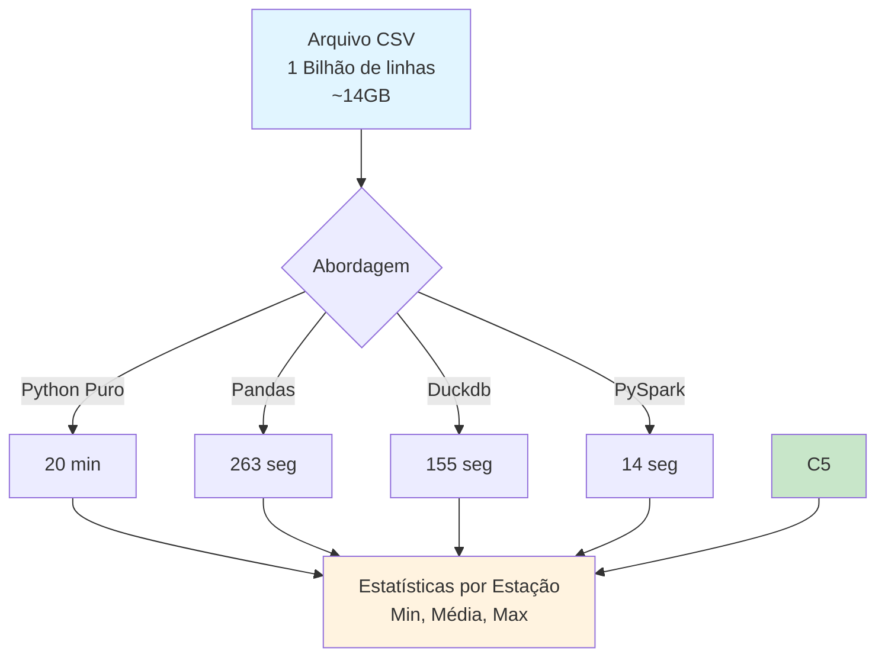

# Projeto: ETL Big Data Python
-----

## 📋 Sobre

Este projeto demonstra como processar eficientemente **1 bilhão de linhas de dados** (~14GB) usando diferentes abordagens em Python. O desafio é calcular estatísticas (mínimo, média e máximo) de temperaturas por estação meteorológica, comparando o desempenho de várias bibliotecas e técnicas.

[](https://suajornadadedados.com.br/)
[](https://python.org)
[](https://pandas.pydata.org/)
[](https://dask.org/)
[](https://pola-rs.github.io/polars/)
[](https://duckdb.org/)

-----

## 📊 Fluxo do Projeto



-----

## 📁 Estrutura do Projeto

```
02-python-big-data-processing/
├── src/
│   ├── create_measurements.py    # Gera arquivo de teste com 1 bilhão de linhas
│   ├── using_python.py            # Implementação em Python puro
│   ├── using_pandas.py           # Implementação com Pandas
│   ├── using_dask.py             # Implementação com Dask
│   ├── using_polars.py           # Implementação com Polars
│   ├── using_duckdb.py           # Implementação com DuckDB
│   └── using_bash_and_awk.sh      # Implementação em Bash + awk
├── data/
│   ├── measurements.txt          # Arquivo gerado com dados de teste
│   └── weather_stations.csv      # Lista de estações meteorológicas
├── pyproject.toml                # Dependências do projeto
└── README.md                     # Este arquivo
```