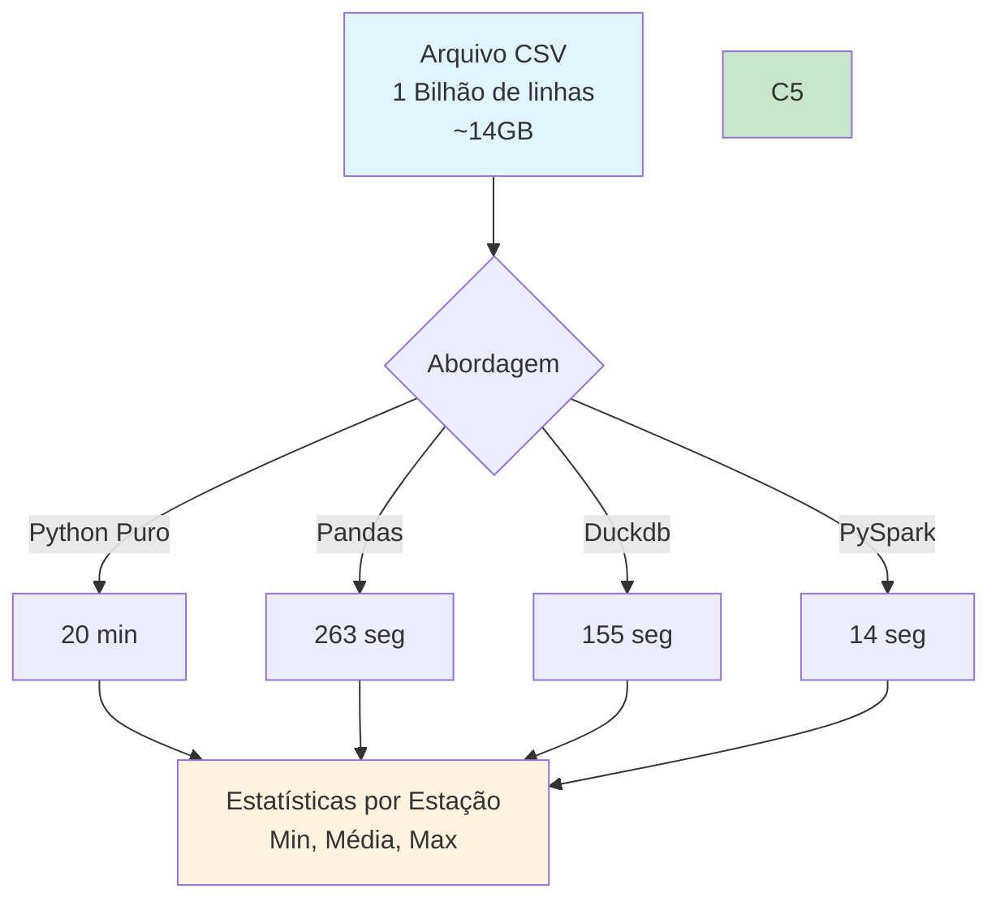

# Projeto: ETL Big Data Python
-----

## 📋 Sobre

Este projeto demonstra como processar eficientemente **1 bilhão de linhas de dados** (~14GB) usando diferentes abordagens em Python. O desafio é calcular estatísticas (mínimo, média e máximo) de temperaturas por estação meteorológica, comparando o desempenho de várias bibliotecas e técnicas.

[](https://suajornadadedados.com.br/)
[](https://python.org)
[](https://pandas.pydata.org/)
[](https://dask.org/)
[](https://pola-rs.github.io/polars/)
[](https://duckdb.org/)

-----

## 📊 Fluxo do Projeto



-----

## 📁 Estrutura do Projeto

```
02-python-big-data-processing/
├── src/
│   ├── create_measurements.py    # Gera arquivo de teste com 1 bilhão de linhas
│   ├── using_python.py            # Implementação em Python puro
│   ├── using_pandas.py           # Implementação com Pandas
│   ├── using_dask.py             # Implementação com Dask
│   ├── using_polars.py           # Implementação com Polars
│   ├── using_duckdb.py           # Implementação com DuckDB
│   └── using_bash_and_awk.sh      # Implementação em Bash + awk
├── data/
│   ├── measurements.txt          # Arquivo gerado com dados de teste
│   └── weather_stations.csv      # Lista de estações meteorológicas
├── pyproject.toml                # Dependências do projeto
└── README.md                     # Este arquivo
```

-----

## Técnicas Apresentadas

### ELT (Extract, Load, Transform)

**ELT** é a nova estratégia de tratamento de dados, o fluxo dela é :
***Extract***: Extração dos dados
***Load***: Duplicação das informações (banco de dados) da etapa de **Extração**
***Transform***: Tratamento dos dados

Uma das ferraments mais utilizadas para transformação de dados em SQL, hoje em dia é o ***dbt-core***,
onde você geralmente aplica essa estratégia de ***ELT*** nele, carregando o seu banco de dados e aplicando seu tratamento através do ***dbt***

-----

#### Considerações
Apesar do alto custo de **storage**, devido a duplicação do banco de dados, é um método eficiente já que em casos de problemas, erros e informações erradas, você falcilmente consegue indetificar essa questão sabendo se é um problema no dataset ou no framework(dbt).
Esse método era inviavel antigamente, devido ao alto custo de store, 1GB chegava a custar milhões de dolares

### ETL (Extract, Load, Transform)

**ETL** é uma estratégia de tratamento de dados já antiga e ainda utilizada, o fluxo dela é:
***Extract***: Extração dos dados
***Transform***: Transformação das informações, depois do carregamento dos dados na etapa **Extract**
***Load***: Disponibilização dos dados para consulmo

-----

#### Considerações
Esse modo de tratamento de dados é amplamente usado, pela eficiencia. Porém em questão a problema de visualização de dados era um pouco mais complicada, devido a não ser se os problemas proviam do dataset ou do framework utilizado para visualizar os dados, foi ai que veio a estratégia **ELT** mais pesada, porém mais fácil de governar. 

---
## Considerações

O arquivo **weather_stations_sample.csv**, tem a lista de cidades em que os dados serão gerados pelo script **create_measurements.py**